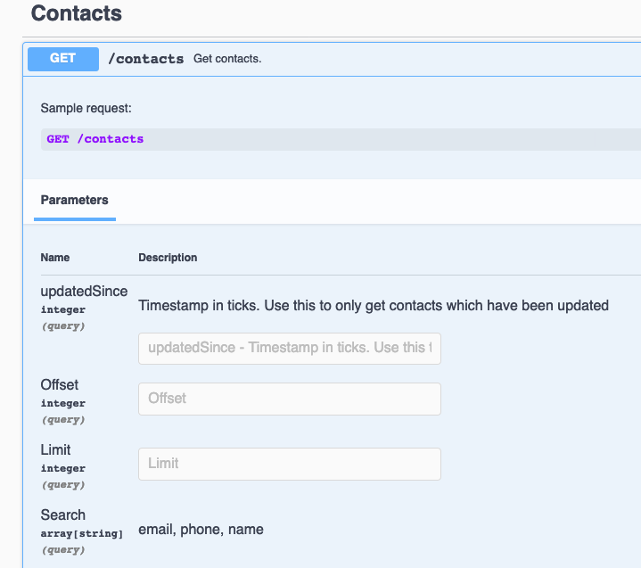

# Searching

### 1. Overview

Some endpoints will have a query parameter called `search` _(array[[string]])_ which allows you to specify multiple search terms. These terms will be combined using an **AND** operator. At the moment, there is no support for other logical operators.

In the Swagger documentation for an endpoint that supports searching, the description will detail what fields can be searched:



This **GET** Contacts endpoint supports searching for *email*, *phone*, and *name*.

### 2. Syntax

The basic syntax for a search term is:

```
search=[field name][operator][value]
```

The following operators are supported:


Operator | Description 
---------|----------
 : | Equals 
 :! | Not equal to 
 :> | Greater than 
 :>= | Greater than or equal 
 :< | Less than 
 :<= | Less than or equal 

#### Wildcards

When searching for string values, the wildcard character `*` can be used:


Example term| Description 
---------|----------
 john* | Will search the field for values _starting_ with 'john'
 *john | Will search the field for values _ending_ with 'john'  
 *john\* | Will search the field for values _containing_ with 'john'

 > All string searches are case insensitive so searching for 'john' will also match with 'John'

#### Examples:

If you wanted to search for a contact whose name contains 'Steele' the query would be:
```
GET ./contacts?search=name:*Steele*
```

If you wanted to find results where the name contains 'Steele' but not 'Hunter' the query would be:
```
GET ./contacts?search=name:*Steele*&search=name:!*Hunter*
```

> The search terms are combined with the AND operator by default and can not be changed at this time.
